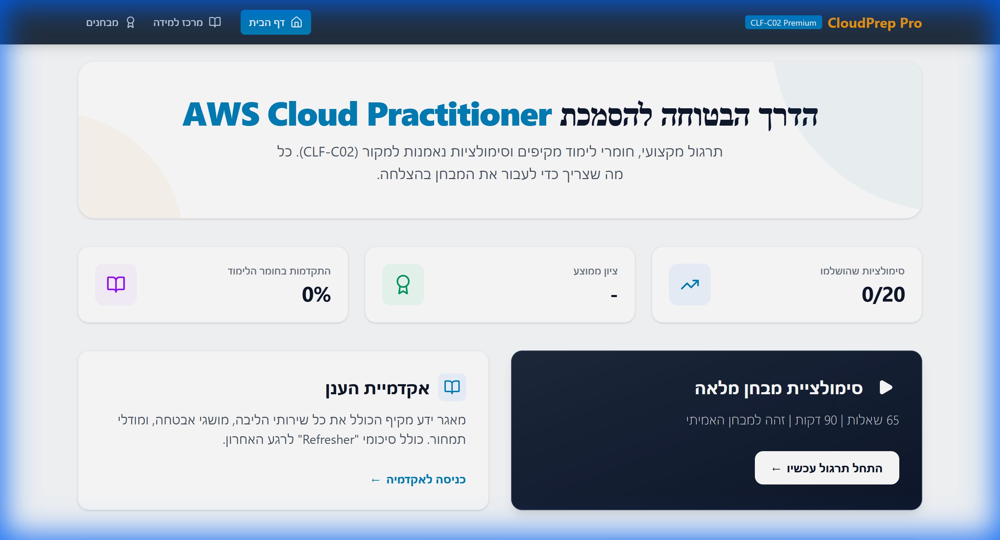
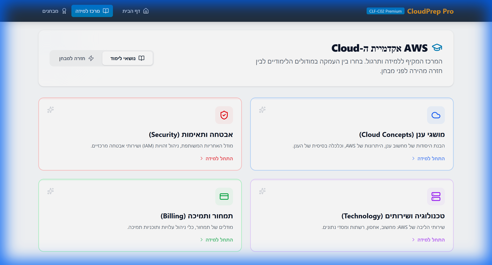
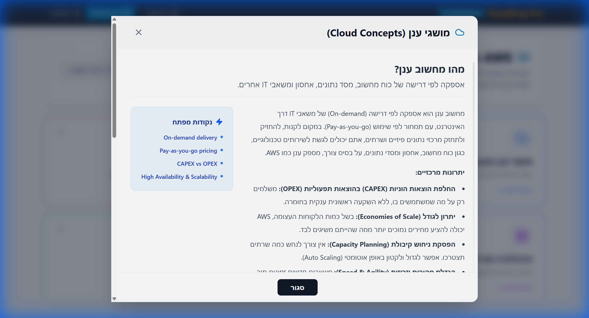
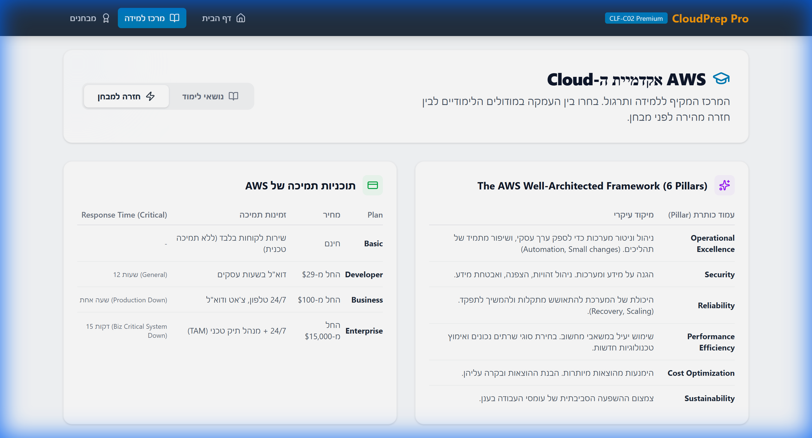
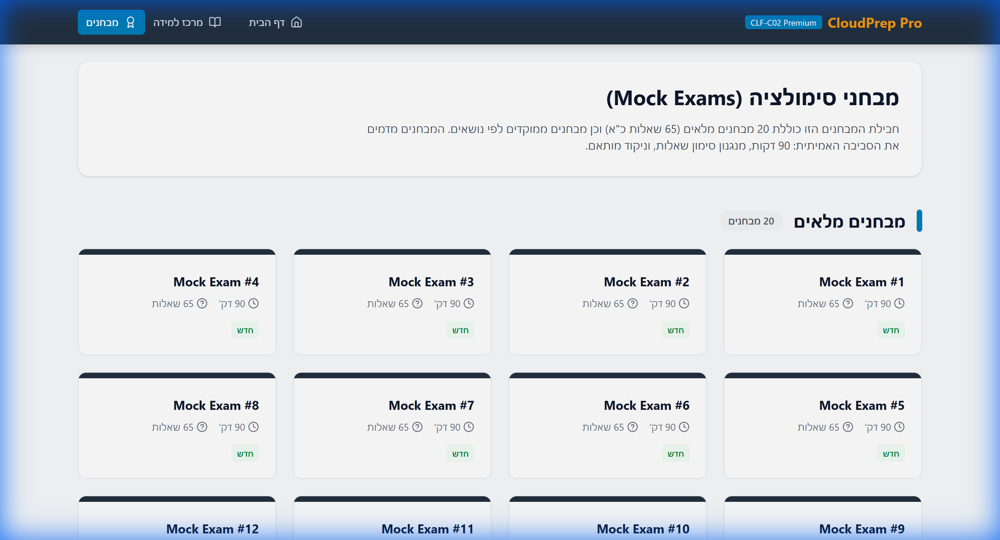

# ☁️ CloudPrep Pro - AWS CLF-C02 Premium

**הפלטפורמה המקצועית להכנה למבחן ההסמכה AWS Certified Cloud Practitioner.**

פרויקט זה נבנה במטרה לספק סביבת לימוד ותרגול איכותית, מקיפה ונגישה לדוברי עברית, המדמה את חווית המבחן האמיתית ומספקת את כל הידע הנדרש למעבר בהצלחה.

## ✨ פיצ'רים מרכזיים

### 🎓 אקדמיית הענן (Learning Academy)
מרכז למידה מקיף המחולק ל-4 תחומי הידע של המבחן:
*   **Cloud Concepts:** יתרונות הענן, סוגי פריסה, מחשוב ענן.
*   **Security & Compliance:** מודל האחריות המשותפת, IAM, אבטחת מידע.
*   **Technology:** שירותי ליבה (EC2, S3, VPC, RDS ועוד).
*   **Billing & Pricing:** מודלי תמחור, כלי ניהול עלויות, תוכניות תמיכה.

### ⚡ Refresher (חזרה מהירה)
אזור ייעודי לחזרה של הרגע האחרון, הכולל:
*   טבלת השוואה של תוכניות תמיכה (Support Plans).
*   ששת עמודי התווך של ה-Well-Architected Framework.
*   רשימת פורטים קריטיים לזכירה (SSH, RDP, HTTP וכו').

### 📝 סימולציות מבחן (Exam Simulator)
*   מנוע מבחנים המדמה את המבחן האמיתי: 65 שאלות ב-90 דקות.
*   אלגוריתם בחירת שאלות המבוסס על אחוזי ה-Domains במבחן האמיתי.
*   משוב מיידי וציון בסיום המבחן.

---

## 🛠️ טכנולוגיות (Tech Stack)

הפרויקט נבנה באמצעות טכנולוגיות מודרניות לביצועים מקסימליים וחווית משתמש מעולה:

*   **React:** ספריית UI מובילה לבניית ממשקים דינמיים.
*   **Vite:** כלי Build מהיר במיוחד.
*   **Tailwind CSS:** לעיצוב רספונסיבי, מודרני ומקצועי (Glassmorphism, Gradients).
*   **Lucide React:** ספריית אייקונים נקייה וקלילה.
*   **TypeScript:** לכתיבת קוד בטוח ויציב.

---

## 📸 צילומי מסך (Screenshots)

### מסך הבית
הכניסה הראשית לאפליקציה, עם סקירה מהירה של ההתקדמות שלך ואפשרויות ניווט מהירות.


### אקדמיית הלמידה
מרכז הידע המקיף. כאן תוכל לבחור נושא ולצלול לעומק.


### פירוט נושא (Modal)
הסברים מעמיקים, דוגמאות ונקודות מפתח לכל שירות ומושג.


### חזרה למבחן (Refresher)
טבלאות סיכום ומידע קריטי לחזרה מהירה לפני המבחן.


### סימולציית מבחן
רשימת המבחנים הזמינים לבחינת הידע שלך בזמן אמת.


---

## 🚀 איך להריץ את הפרויקט?

1.  **התקנה:**
    ```bash
    npm install
    ```

2.  **הרץ שרת מקומי:**
    ```bash
    npm run dev
    ```

3.  פתח את הבראוזר בכתובת `http://localhost:5173`.

---

נבנה באהבה 💙 ובהצלחה במבחן!
